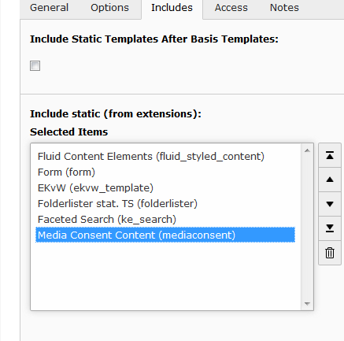
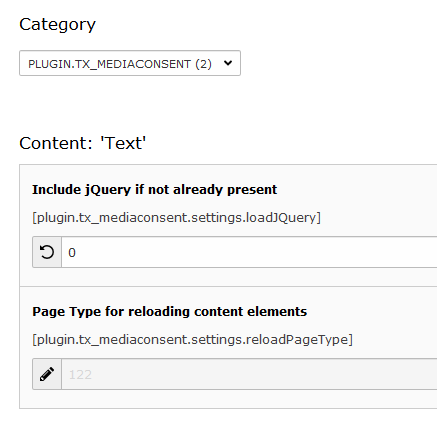

.. ==================================================
.. FOR YOUR INFORMATION
.. --------------------------------------------------
.. -*- coding: utf-8 -*- with BOM.

.. include:: ../Includes.txt

.. _admin-manual:

Administrator Manual
====================

.. _admin-installation:

Installation
------------

To install the extension, perform the following steps:

- Go to the Extension Manager
- Install the extension
- Select the static template

   After install, select the static template

.. important::

   This extensions adds a little JavaScript to the webpage and needs the jQuery library. Therefore it assumes that the top-level TypoScript object of type PAGE is named "page" as it is generally recommended.

If this is not the case, you have to configure manually the path to the jQuery library and to the extension's JavaScript file. The default configuration coming with this extension is as follows (in setup.txt): 

.. code-block:: typoscript

    # Include jQuery. Assumes "page" as name for top level PAGE Object
    [globalVar = LIT:1 = {$plugin.tx_mediaconsent.settings.loadJQuery}]
    page.includeJSFooterlibs.jquery = EXT:mediaconsent/Resources/Public/js/jquery.min.js
    [end]

    # Include JavaScript functions for reloading Content Element. 
    # Assumes "page" as name for top level PAGE Object
    page.includeJSFooter.tx_mediaconsent = EXT:mediaconsent/Resources/Public/js/tx_mediaconsent.js

For the jQuery library: If your website already makes use of it, you can disable the extension's own file by setting a constant, see below.

Editing Constants
^^^^^^^^^^^^^^^^^

   Constants for jQuery and the reload page type

To disable the include of this extension's own jQuery file, you may use the constant editor and set the "loadJQuery" constant to 0. This is for the case that you are having jQuery in your setup and don't need it included twice.

Another constant (reloadPageType) deals with the very rare case that you already use a pagetype of 122 somewhere in your typoscript configuration. Then you can change it here.