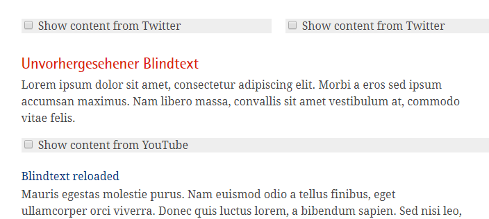
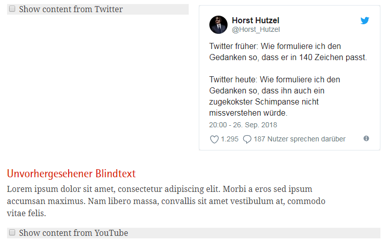

.. include:: ../Includes.txt

.. _introduction:

Introduction
============

.. _what-it-does:

What does it do?
----------------

This extension loads HTML content only after the user has clicked on a short note expressing his/her agreement to see it.

It is useful for embedding HTML snippets (often called widgets) from social media content providers like Facebook, Twitter and others. If the user does not agree, no widget is shown and no personal data (IP number etc.) is transferred to the social media provider.

The extension provides a new content element called "Media Consent Opt-In" which has two specific fields: one for the HTML snippet embedding the content, another for selecting the content provider (Facebook, Twitter...)

.. _screenshots:

Screenshots
-----------

.. figure:: ../Images/new_element.png
   :width: 500px
   :alt: Media Consent Opt-In

   Extension provides new content element "Media Consent Opt-In"

   Extension provides new content element "Media Consent Opt-In"

   After clicking to agree, content is being loaded and displayed

