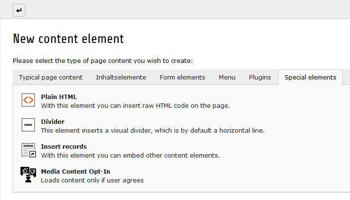
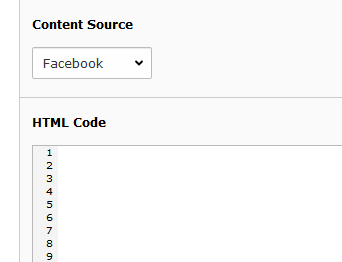

.. ==================================================
.. FOR YOUR INFORMATION
.. --------------------------------------------------
.. -*- coding: utf-8 -*- with BOM.

.. include:: ../Includes.txt

.. _user-manual:

Users Manual
============

This extension provides a new content element called **Media Consent Opt-In**. Add it into your page like any other content element, you will find it on the "Special element" Tab:

   Extension provides new content element "Media Consent Opt-In"

There are two fields, **Content Source** and **HTML Code**:

   Fields for Content Provider and HTML Content

Use **Content Source** for selecting the content provider. If it is not listed, choose "Other" which will result in a more general message in frontend.

**HTML Code** then contains the HTML snippet used to embed the social media content. These snippets can be fetched directly from the Providers as you probably know. After the user has clicked to agree, this HTML will be loaded dynamically.

